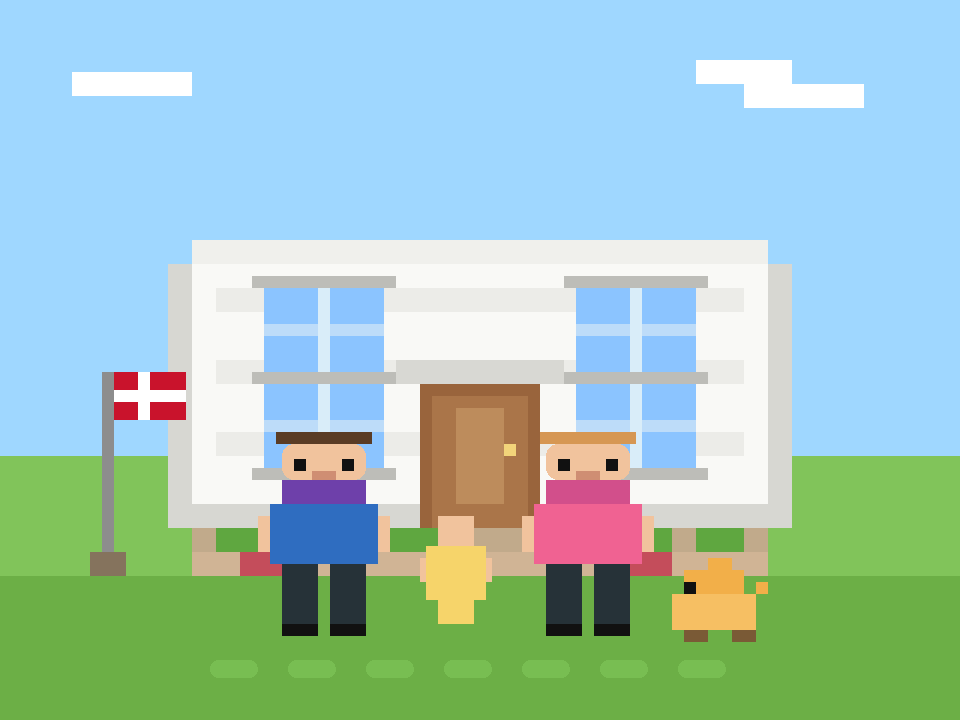

# Welcome to hvidhuset-lab

We are a family of four, and this is our cyber home, playground, and workshop.

Here we share the projects, experiments, and ideas we build together across technology, creativity, and learning. You will find everything from code and electronics to art and design.

We hope you enjoy exploring our work as much as we enjoy creating it.

